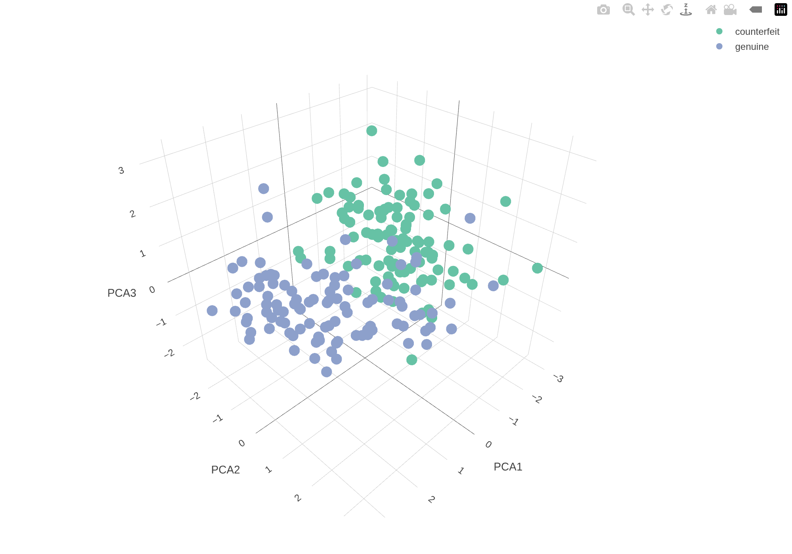

```{r setup, include=FALSE}
knitr::opts_chunk$set(echo = TRUE, warning = FALSE)
```

# Bank notes

```{r}
library(tidyverse)
library(factoextra)
library(webshot2)

data(banknote, package = "mclust")
swissTib <- as_tibble(banknote)

head(swissTib)

# La matriz de covarianza
cov(swissTib[, 2:7])
# No es necesariamente la que pca usa, pues hace falta centrar y escalar los datos

# Quitamos la columna de etiquetas
pca <- select(swissTib, -Status) %>%
  prcomp(center = TRUE, scale = TRUE)
# Los datos estan centrados y escalados (normalizados) [como normalizar un vector]
```
Las proyecciones están en:
```{r}
pca$x %>% head
```

Los vectores propios están en (matriz $U$):
```{r}
pca$rotation
```

Podemos ver la desviación estándar en cada dirección principal con:

```{r}
pca$sdev
```

Para obtener los valores propios (matriz $\Lambda$):

```{r}
(pca$sdev)^2
```

La desviación estándar acumulada con:
```{r}
summary(pca)
```

Graficamos las primeras dos componentes principales:
```{r}
library(plotly)
fpca <- get_pca(pca)

fviz_screeplot(pca, choice="variance", addlabels=TRUE)

swiss2Pca <- swissTib %>%
  mutate(PCA1 = pca$x[, 1], PCA2 = pca$x[, 2])

plot_ly(data=swiss2Pca, x=~PCA1, y=~PCA2, color=~Status)
```
Graficamos tres componentes principales:

```{r}
library(htmlwidgets)
library(plotly)
library(webshot2)
Sys.setenv(CHROMOTE_CHROME = "/usr/bin/google-chrome")

swiss3PCA <- swissTib %>%
  mutate(PCA1 = pca$x[, 1], PCA2 = pca$x[, 2], PCA3 = pca$x[, 3])
p <- plot_ly(data=swiss3PCA, x=~PCA1, y=~PCA2, z=~PCA3, color=~Status)

# 2. Save the plotly object as a standalone HTML file
temp_html <- "temp_plot.html"
saveWidget(p, temp_html, selfcontained = TRUE)

# 3. Use webshot2 to take the picture (where delay/zoom actually work!)
webshot2::webshot(
  url = temp_html, 
  file = "3d_snapshot.png", 
  delay = 3,    # Wait 3 seconds for WebGL to load
  zoom = 2,     # Double the resolution for the PDF
  vwidth = 1000, 
  vheight = 700
)

#
```

# Agregar nuevos datos
```{r}
newBanknotes <- tibble(
  Length = c(214, 216),
  Left = c(130, 128),
  Right = c(132, 129),
  Bottom = c(12, 7),
  Top = c(12, 8),
  Diagonal = c(138, 142)
)
predict(pca, newBanknotes)
```

